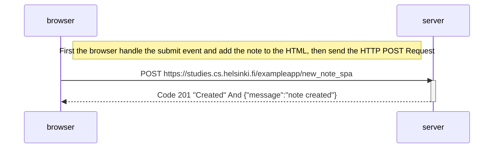

```mermaid
sequenceDiagram
    participant browser
    participant server

    note right of browser: First the browser handle the submit event and add the note to the HTML, then send the HTTP POST Request

    browser->>server: POST https://studies.cs.helsinki.fi/exampleapp/new_note_spa
    activate server
    server-->>browser: Code 201 "Created" And {"message":"note created"}
    deactivate server
```